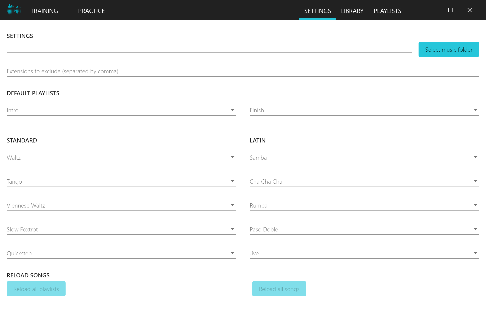
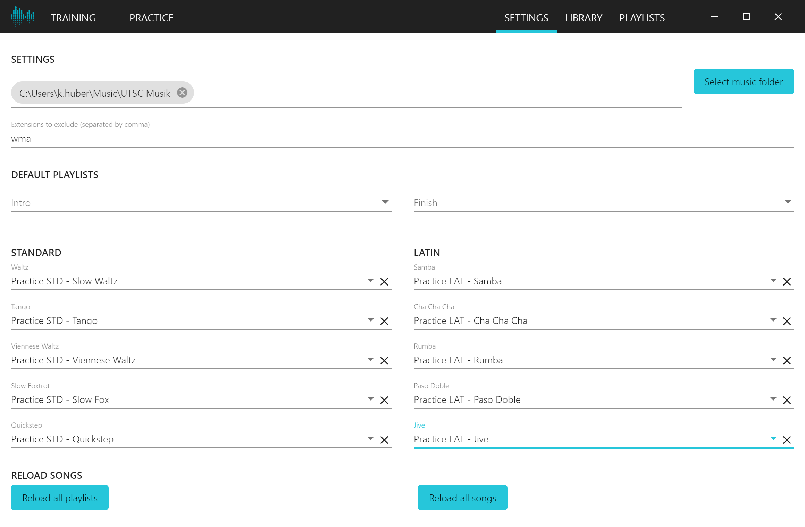
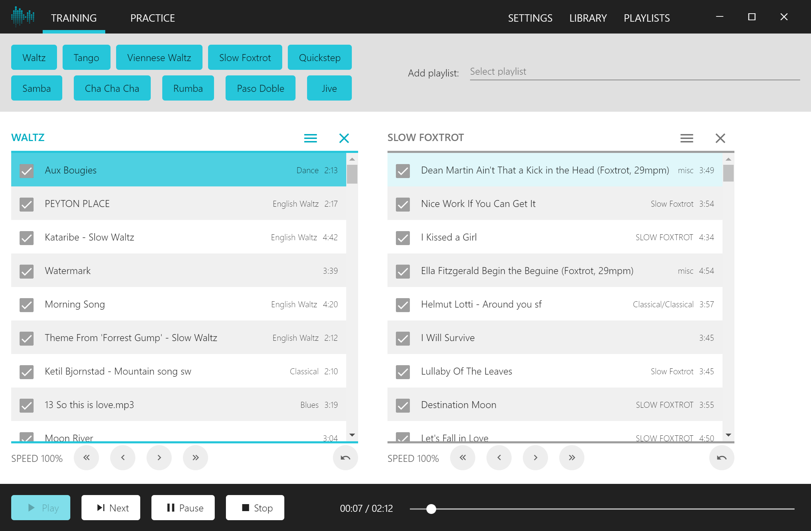
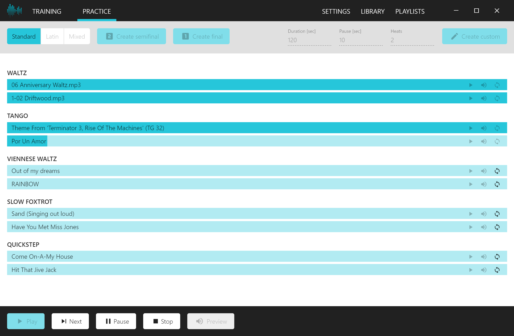

# Floorcraft Music Player

Music player for dance sport studios that supports the standard dances Waltz, Tango, Viennese Waltz, Slow Foxtrot, and Quickstep and the latin dances Samba, Cha Cha Cha, Rumba, Paso Doble, and Jive.

## Prerequisites

- Windows 7 and later
- You need to have at least one [Windows Media Player](https://support.microsoft.com/en-us/help/14209/get-windows-media-player) playlist for each dance. The Floorcraft Music Player is not able to create or modify playlists. It depends on the playlists configured in Windows Media Player.

## Installation

1. Get the latest version from [GitHub](https://github.com/karin112358/floorcraft-music-player/releases).
2. Download Floorcraft.Music.Player.Setup.x.y.z.exe.
3. Run Floorcraft.Music.Player.Setup.x.y.z.exe.
4. When the setup has finished the player is started automatically.

## Configuration

When the player is started the first time, the settings page is shown.

First you have to select the music folder. Then you can select the default playlist for each dance.

## Features

### Training Mode

In training mode you can select multiple dances that will be played alternately.

### Practice Mode

In practice mode you can create rounds with the desired length, number of heats and pause length.

